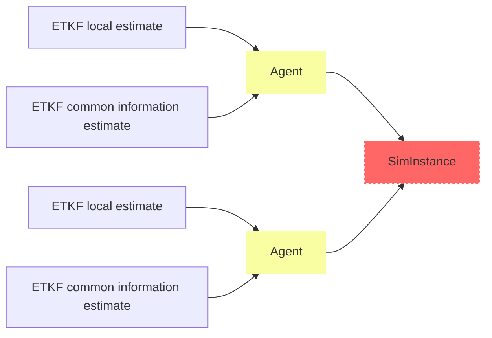

# Event-Triggered Decentralized Data Fusion

This folder contains the core ET-DDF library, including code for simulations and several helper functions. This code can be used on its own for pure python simulations, or can be used in ROS with the help of a wrapper. More information can be found in the README located in the [`ros_wrapper/` README](../ros_wrapper/README.md).

## Simulation Architecture

The ET-DDF code is structured to enable both pure python simulations and use by outside libraries. As such the code architecture is broadly structures as follows:



## Running Simulations

In order to run a single (or many Monte Carlo simulations) pure python simulation, `sim.py` provides a command line interface that is used as follows

```
$ python sim.py -c <path to config file> -s <path to location to save data>
```

You can get information about the options by running

```
$ python sim.py -h
```

or

```
$ python sim.py --help
```

The above will run simulations as specified by the config file located in the [`config/` folder](../config/config.yaml) or whichever config location you have specified. It will save simulation data in a new folder located in the provided path.

## Simulation Data Visualization

Simulation data can be visualized using the functions in `data_viz.py` located in the `helpers/` folder. Run

```
$ python helpers/data_viz.py -h
```

to see available options for plotting data. Currently the desired parameters for plotting are specified directly in the functions located in `data_viz.py`, but a better method for specifying these values without file modifications is in progress.

## Library Structure

This folder contains the following

- `filters/`
- `dynamics_folder/`
- `helpers/`
- agent.py
- covar_intersect.py
- quantization.py
- sim.py

### Filters

This folder contains the various filters used in ET-DDF. The current main filter type used in ET-DDF is the linear event-triggered Kalman filter (ETKF), with the non-linear event-triggered extended Kalman filter (ETEKF) in development. multiple instances of the ETKF are used in each ET-DDF instance. This folder also contains a regular Kalman filter implementation for baseline comparison, as well as a EKF implementation for the same reason.

### Dynamics

The `dynamics_folder/` contains the nearly constant velocity dynamics specification that is used in simulations. It is currently the only implemented dynamics type, but this does not preclude adding additional types.

### Helpers

This folder contains various helper functions for the implementation of a pure python ET-DDF simulation, including config file handling, simulation data handling, visualization functions for sim data, and handlers for message passing during simulation.

### Agent

While the ETKF implementation is where the actual event-triggered filtering algorithm is implemented, the Agent class contained in `agent.py` handles all incoming and outgoing messages for the filters, as well as handles covariance intersection for estimate fusion and synchronization. This class is what primarily comprises an "instance" of ET-DDF.

### Covariance Intersection

The covariance intersection implementation resides in this file. Covariance intersection (CI) is a data fusion algorithm for multivariate Gaussian state estimates that balances the uncertainty in two state estimates. This function is used by the Agent class to perform CI.

### Quantization

The `quantization.py` file contains the Quantizer class, which provides an interface to quantize and diagonalized measurements and state estimates in order to compress them, as well as decode quantized measurement and state estimates received from other ET-DDF instances. The Quantizer instance is configured using the `quantization_config.yaml` config file, also located in the [`config/` folder](../config/quantization_config.yaml).

In the config file, the number of quantization bins can be chosen, as well as the range of values over which the data will be quantized. The `num_bins` parameter should be used for quadratic binning, and the `resolution` parameter should be used for uniform binning. These are the only two quantization types currently supported.

**Note:** The quantization of a covariance matrix produces a non positive semi-definite result, which creates many problems for fusing said covariance. As such, **the only type of compression currently supported is one using both quantization and diagonalization**, despite there being options to enable each separately in the config file, and the checks in `agent.py` having cases for each. Solving this is a research question that will addressed at some point in the future.

### Simulation

The `sim.py` contains the code for a pure python ET-DDF simulation framework. This code handles the propagation of ground truth for vehicles based on the specified dynamics, instantiation of Agent and ETKF instances, the generation of sensor measurements to be fed to Agent instances, and the recording of simulation data. Additionally, a `sim.py` SimulationInstance handles the passing of messages between ET-DDF instances, including raw measurements, thresholded measurements, and state estimates. The behavior of simulations is specified in the config file located in the [`config/` directory](../config/config.yaml).