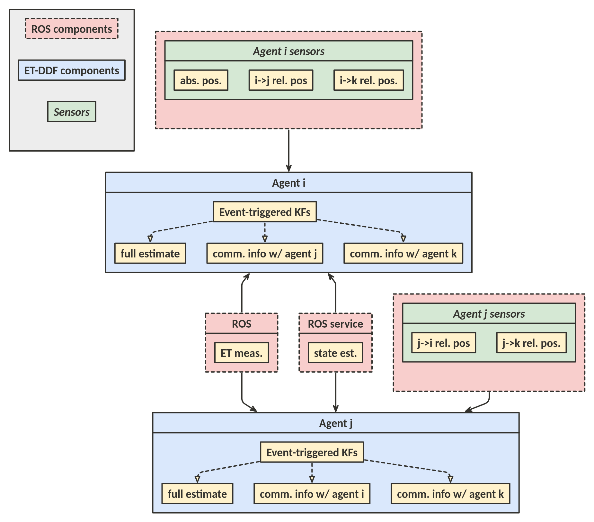

# ROS2 ET-DDF

This ROS2 package, `etddf_ros2`, integrates the event-triggered decentralized data fusion (ET-DDF) library into a ROS2 framework for use in simulations and on hardware. Below are run instructions, as well as an overview of the architecture of the system.

This package was developed to support the DARPA OFFSET project.

_Note: This software is currently configured to use linear dynamics and linear absolute and relative position measurements. All agents estimates and measurements are assumed to be in an ENU frame._

---

## Installation Instructions

These instructions assume you have already installed ROS2, and created a ROS2 workspace!

In order to use the `etddf_ros2` package, first clone the `et-ddf` repository to some location on your machine, `<et-ddf repo location>`. This will download both the ROS2 package as well as the core ET-DDF library. Checkout the `ros2_port` branch to make sure you have the ROS2 package. _Note: the repository also contains a ROS1 ET-DDF package, so be careful to not get the two confused!_

```
$ git clone https://github.com/COHRINT/et-ddf.git
$ git checkout -b ros2_port
$ git pull
```

In order to be able to access the ET-DDF library, we need to install it to the `lib/` folder of `etddf_ros2` in our ROS2 install space. We can do this using pip like so, to first install dependencies in our virtual environment, and then to also install to the workspace:

```
$ cd <et-ddf repo location>/python/
$ pip3 install -e . -r requirements.txt
$ pip3 install -e . --target <path to ros2 workspace>/install/etddf_ros2/lib/etddf_ros2
```

This installs the core ET-DDF modules into your path so python will be able to find them. _Note: make sure you use pip3 to install everything, as ROS 2 requires python3, and running everything in python3 will reduce headaches._

The following packages are installed:
- pyyaml
- numpy
- scipy
- matplotlib
- pudb
- catkin_pkg
- empy
- rospkg

Next, create a symbolic link from the ROS package (and the message types package), located in the `ros2_wrapper` folder, to a ros2 workspace, then build and install your workspace, and source it:

```
$ ln -s <et-ddf repo location>/python/ros2_wrapper/ <path to a workspace>/src/offset_ros2
$ ln -s <et-ddf repo location>/python/etddf_ros2_msgs/ <path to workspace>/src/offset_ros2_msgs
$ cd <path to workspace>
$ colcon build --symlink-install
$ source install/setup.bash
```

This will build your workspace, and generate the necessary message types to use the package, as well as make sure your workspace is in your ROS path.

---

## Run Instructions

### Launching full simulation

To launch a full simulation, including simulated measurements, control input and simulated vehicles (represented as point masses):

```
$ ros2 launch etddf_ros2 etddf.launch.py
```

### Launching agent instance

To launch an instance of ET-DDF, use the `agent.launch.py` launch file. This will launch an ET-DDF node, a comms module node, and, if set, nodes for simulating sensors measurements ang generating control input.

```
$ ros2 launch etddf_ros2 agent.launch.py id:=[id int value] agent_name:=[string in form "agent_<id>"]
```

The arguments are as follows:

- id: integer to uniquely identify an instance of ET-DDF -- __Required__
    - Note: it is important that these ids correspond with the ids in the config files, otherwise, messages will not be sent to the correct agents, or might not be sent at all
- agent_name: name used for namespacing the ET-DDF instance -- _default:_ "agent_\<id>"
- log_level: level of ROS log messages will be displayed to the console -- _default:_ "INFO" 
    - options are: "DEBUG", "INFO", "WARN", "ERROR", "FATAL"
- sensors: boolean to simulate sensor measurements -- _default:_ false
- planner: boolean to simulate control input -- _default:_ false


### Viewing Performance

To view the quality of estimates, you can use the `etddf_ros2/helpers/viz.py` node. This node is currently only configured for a 4 agent case, but can be used to confirm things are functioning properly. 

This node uses simuation ground truth pose data to compute estimate error and error magnitude. These can be viewed in a terminal, or using the `rqt` utility.

---

## Configuration Instructions

### Config Files

There are two main config files used for running ET-DDF in ROS. Both are located in the `config/` folder of the `etddf_ros2` package.

The `ros_agent_config.yaml` config file is used to configure ET-DDF instances, including setting connections, ET thresholding, CI thresholding, and update rate for the ET-DDF instance.

_Note: All connections for the entire network must be specified in the above config file._
Connections are specified as a nested list, where index corresponds to the agent, and the list located at that index are the ids of the agent's connections. _E.g. [[1],[0]] represents agent 0 being connected to agent 1 and vice versa._

The `points.yaml` config file is used to configure simulation parameters, if a simulation is being run, such as starting location, planner type, and simulated sensor noise and update rate. 

### Adding agents to simulation

Here you can add config information about additional agents. Just copy the form of the existing `agent_<id>` blocks to add more. Also make sure to specify the measurement connections of each agent, which should match the connections specification described above. Finally, in `ros_agent_config.yaml`, add the new agent ids to the sensors block at the bottom of the file.

The current configuration is stable and performs well, but if the CI threshold is set too low, and the update rate too high or too low, ET-DDF instances will struggle to keep up, start dropping messages, and diverging. This is also dependent on the compute available to run the simulation.

__NOTE: if you make changes to any of the config files, make sure to rebuild your workspace, to reinstall the updated files to the share directory of the `etddf_ros2` package in the workspace.__


### Configuring Topic Names

To configure ET-DDF for use in a system, there are a few topics that need to be configured. 

First are the topics for the sensors each ET-DDF instance uses, found in `etddf_ros2/src/agent_wrapper.py`. The default topic names are those that are used when simulating sensor measurements.

Second is making sure that all ET-DDF instances are namespaced correctly. 

---

## Architecture Overview

The `etddf_ros2` package provides a wrapper around the `etddf` ET-DDF library, as well as the tools to manage, convert, and move sensor, and between-agent messages through the system.

Below is a block diagram of a high-level view of the system:

<!--  -->
<!-- Format: ![System diagram] -->


### ROS Nodes

There are two nodes that are launched for each use of `agent.launch.py` to wrap the ET-DDF library:

- agent_wrapper
- comms_module

The __agent_wrapper__ node is the actual wrapper for the ET-DDF library, and runs at a rate defined in the `ros_agent_config.yaml` config file. Running asynchronously are the callbacks to queue messages for local sensor measurements, and thresholded measurement messages from other agents.

The update loop performs the following steps:

1. Empty the local measurement queue, and convert messages from ROS to Python messages
2. Update filters and threshold measurements using the _process_local_measurements()_ function
3. Convert the thresholded measurements to ROS messages and publish to the comms module, to be sent to connected agents
4. Empty the received (from other agents) measurement queue, and convert from ROS to Python messages
5. Update filters using the _process_received_measurements()_ function
6. Check if covariance intersection (CI) needs to be performed, and if so, generate and send CI requests to other agents, queuing responses
7. Empty the CI state message queue, convert to Python messages, and perform CI with each state message.

See the README for the `etddf` library to read more about the architecture and underlying algorithms for ET-DDF.

The __comms_module__ node simply abstracts communication with the outside world by allowing the __agent_wrapper__ to send all messages to one topic, from which the module sends each message to the appropriate destination agent's __comms_module__.

There are also two additional nodes available for use in simulations:

- publish_sensors
- planner

The __publish_sensors__ node uses ground truth pose data for a agent to create simulated sensor measurements to be used for ET-DDF. The __planner__ node generates control input in the form of twist messages for simulated agents (represented by point masses). These two nodes allow for a full ET-DDF simulation without additional hardware or simulators.

_NOTE: The CI update service described above is currently implemented as a collection of request and response topics instead, as there were significant problems with getting the service to function. The topics implementation is intended to act like a service, but will not block for responses. Performance of the algorithm does not appear to have been affected by this change._

__If you encounter problems while attempting to use this package, feel free to contact the author at `ian.loefgren@colorado.edu`__